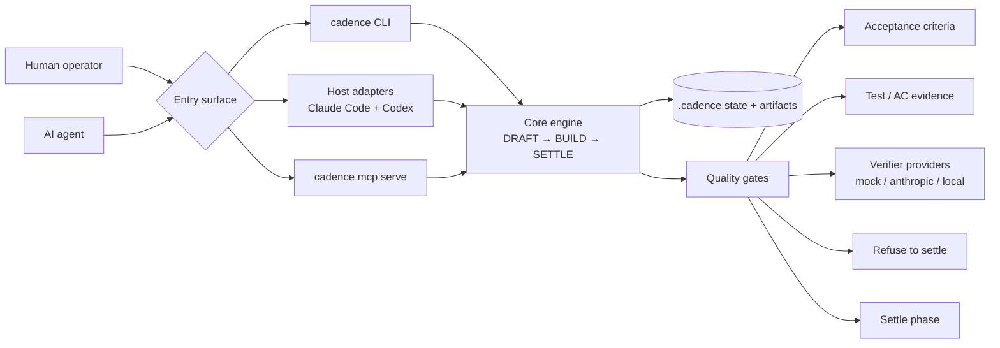

# CADENCE

[](https://github.com/manehorizons/cadence/actions/workflows/ci.yml)

**Cadence stops AI agents from shipping work they only *claim* is done** — a DRAFT→BUILD→SETTLE loop whose quality gates re-check your acceptance criteria and refuse to settle when they don't pass.


Above, the always-fire `build-test-must-pass` gate blocks a plausible lost-penny bug in a bill-splitter — `$100.00` split 3 ways summing to `$99.99`. The AI marked the task **DONE**; the gate didn't agree, and refused to close the loop. The demo repo carries the story past the block — the fix, then a clean **settle** once `$100.00` actually splits to `$100.00` — with real git history and reproduce-it-yourself steps: **[cadence-demo-billsplit →](https://github.com/manehorizons/cadence-demo-billsplit)**

## For technical reviewers

Cadence is an open-source TypeScript developer tool for AI-assisted software workflows. It uses a DRAFT→BUILD→SETTLE loop with configurable quality gates to verify declared acceptance criteria before work is considered complete. It can be driven from the CLI, Claude Code, Codex, or any MCP-capable host through its local MCP server.

**Problem.** AI coding agents can produce plausible work and mark a task complete before the promised behavior is actually verified.

**Solution.** Cadence wraps AI-assisted development in a DRAFT→BUILD→SETTLE loop. Work begins with declared acceptance criteria, progresses through explicit tasks, and cannot settle until configured gates re-check the state of the work.

**Why it matters.** Cadence gives teams a practical control layer for adopting AI coding agents without treating the agent's self-report as proof.

**Architecture at a glance.** One core engine is exposed through the CLI, host adapters (Claude Code, Codex), and an MCP server. The same loop and gate logic stay authoritative across every surface.



See [GitHub Releases](https://github.com/manehorizons/cadence/releases) for package changelogs, npm publication status, and release verification notes.

## Why this exists

Cadence grew out of working with **GSD (Get Shit Done)** — a planning framework that produces genuinely disciplined work, but at a real cost in tokens, wall-clock time, and constant back-and-forth. I wanted that discipline without that cost.

So Cadence isn't GSD-lite. It keeps the quality gates — they re-check your acceptance criteria and refuse to settle unverified work — but lets you choose which gates fire for a given change. A complex, risky change gets the full battery; a one-line fix doesn't pay for it. Same rigor, far less drag.

## One engine, three surface categories

Cadence has **one core engine and three surface categories** — CLI, host
adapters, and an MCP server — for **four current entry points**:

- The **`cadence` CLI** is the engine — it implements the DRAFT→BUILD→SETTLE loop and all quality gates. You run it in a terminal; a human operator or an AI agent can drive it. Completely host-agnostic.
- **Host adapters** wire the same engine into a specific coding agent's lifecycle — currently two:
  - The **`cadence-host-claude-code install`** adapter wires Claude Code via lifecycle hooks and 14 slash commands. Claude Code is the **reference adapter** for *ambient* edit-time gates (boundary checks, anomaly detection as you edit).
  - The **`cadence init --host codex` / `cadence-host-codex install`** path wires the OpenAI Codex CLI via lifecycle hooks and global prompt commands. Run the bootstrap before opening Codex for the first time so Codex sees the commands on its first useful session. It is a shipped conformance consumer of the host-adapter contract, and also supports ambient edit-time boundary checks via its own hooks.
- **`cadence mcp serve`** exposes the engine as a local [MCP](https://modelcontextprotocol.io) server over stdio, so any MCP-capable host (Claude Desktop, Cursor, other agents) can drive the loop with no bespoke adapter. It covers the imperative loop only (command-boundary gates run; ambient edit-time gates need host hooks). See **[MCP server](./docs/mcp.md)**.

## How it compares

Cadence is a verification layer, not an agent and not a CI service. The point of difference is *what* it checks: the specific acceptance criteria you declared for a unit of work, re-derived from real task state — not just "did the build stay green."

| | What it checks | Where Cadence differs |
|---|---|---|
| **CI / a test runner** | The suite passes on a branch, after you push. | CI has no idea what *this task* promised. Cadence re-checks each declared acceptance criterion before it will even close the loop, and runs the suite as one of several gates. |
| **A linter / pre-commit hook** | Style and static rules on the diff. | Those never ask "was the work actually accomplished?" Cadence gates the *claim of done* against the criteria, not formatting. |
| **An agent harness / framework** | Orchestrates the agent *doing* the work. | Cadence is adversarial to the agent's self-report. It's host-agnostic — a CLI that sits behind any agent (or none) and refuses to accept an unverified "done." |
| **A heavyweight planning framework (e.g. GSD)** | Runs a full, fixed discipline on every change. | Cadence keeps the rigor but makes the gate set configurable per change (profile × tier) — you pay only for the gates a change actually needs. GSD's discipline without GSD's wall-clock cost. |

The core primitive nothing else has: **refusal-to-settle on re-verified declared criteria.** 

The agent isn't believed; the state is.

> **Heads-up on the default verifier.** Out of the box every gate uses `mock`, a
> deterministic offline **placeholder** that only checks each acceptance criterion
> links to a test — it is **not real verification**. Run [`cadence activate`](./docs/providers.md)
> to turn on a real AI verifier (Anthropic or a local model); `cadence doctor`
> tells you whether real verification is actually wired.

## Quickstart

No install, no repo writes — watch one real loop run, including the moment
settle refuses to close a phase the tests don't back, then closes once they do:

```sh
npx -y @manehorizons/cadence-core tutorial
```

For daily use, install the CLI globally (requires Node ≥ 20):

```sh
npm install -g @manehorizons/cadence-core
```

New to CADENCE? Run `cadence start` — a guided menu that picks the right setup
command for what you're doing. (Once you're set up, `cadence quickstart` is the
read-only map of where you are and your next moves.)

The fastest way to *see* a loop run in your own repo — `--demo` seeds a
ready-to-approve phase so there's nothing to hand-edit:

```sh
mkdir my-app && cd my-app
cadence init --demo        # zero prompts: name + gate profile are derived
cadence draft approve 01-demo 01
cadence done T1
cadence settle run --ac AC-1=pass
```

`cadence init` asks nothing — it derives the project name (from `package.json`
or the directory) and the gate profile (from git history). Already have an
`ANTHROPIC_API_KEY`? Add `--activate` to turn on real verification in the same
step (the key is never stored). In a Claude Code workspace (`.claude/` present),
add `--wire-host` to install the adapter in the same step too. For Codex, run
`cadence init --host codex` before opening Codex so hooks, prompt commands, and
`AGENTS.md` are ready for the first session.

To drive a real phase yourself instead of the demo:

```sh
cadence init
cadence draft new --title "Fix login timeout" --template bugfix
# edit the generated DRAFT: templates are scaffolds, not proof
cadence draft approve 01-fix-login-timeout 01
# ^ non-TTY (CI/agents)? add --no-approve — see the gate-profiles note below
cadence build task T1 --status=DONE
cadence settle run --auto
# ^ Cadence refuses: AC-1 has no test. That's the point — it won't settle
#   unverified work. As the operator, you can verdict the criterion yourself:
cadence settle run --ac AC-1=pass
```

Driving CADENCE from **Claude Code**? Wire the adapter into a project:

```sh
npx @manehorizons/cadence-host-claude-code install
```

Driving it from **another MCP host** (Claude Desktop, Cursor, an agent)? Point the host at the MCP server — no adapter needed:

```jsonc
// .mcp.json
{ "mcpServers": { "cadence": { "command": "cadence", "args": ["mcp", "serve"] } } }
```

> **Heads-up — gate profiles and `approve`:** `cadence init` suggests a gate profile from repo maturity — a repo with **≥20 commits** gets `standard`, a younger repo gets `auto` (override with `--gate-profile`). The profile sets how strict `draft approve` is:
> - **`auto`** — `approve` runs non-interactively (good for solo and agent loops).
> - **`standard` / `strict`** — `approve` is gated behind an **interactive prompt**. In non-TTY contexts (CI, agents) it **refuses** unless you pass `--no-approve`.

> **`--local` writes machine-absolute paths — do not commit it.** `cadence-host-claude-code install --local` bakes absolute paths to *this machine's* workspace into the settings file. Add the settings file (e.g. `.claude/settings.local.json`) to `.gitignore`; other clones/machines cannot resolve those paths.

## Full user guide

See **[docs/README.md](./docs/README.md)** for the complete user guide:

- [Quickstart](./docs/quickstart.md) — no-install demo, first real template, and full loop walkthrough
- [Concepts](./docs/concepts.md) — the loop, gates, profiles, and two-commit convention
- [CLI guide](./docs/cli.md) — all subcommands and flags
- [Claude Code integration](./docs/claude-code.md) — hooks and slash commands
- [MCP server](./docs/mcp.md) — drive the loop from any MCP host (`cadence mcp serve`)
- [Providers](./docs/providers.md) — OpenAI, Claude, Ollama, and custom LLMs
- [Command reference](./docs/reference/commands.md) — exhaustive CLI reference
- [Config reference](./docs/reference/config.md) — full `.cadence/` config schema
- [Release process](./docs/release.md) — maintainer checklist for npm, tag, and GitHub Release integrity

## Continuous integration

`.github/workflows/ci.yml` runs `lint → typecheck → test → build` on every PR and push to `main`, across Node 20 + 22 on Ubuntu.

**Enforcing the gate.** A tracked hook `.githooks/pre-push` (wired via `git config core.hooksPath .githooks`) runs the full `pnpm turbo run lint typecheck test build` before any push that updates `main` and aborts on failure. Bypass deliberately with `git push --no-verify`.

## About the name

**CADENCE** is named for the rhythm of its core loop — the steady DRAFT → BUILD → SETTLE cadence it keeps on every phase of work. Earlier drafts carried a backronym; it's been retired as a forced fit. The word — the rhythm — is the keeper.

## License

MIT
